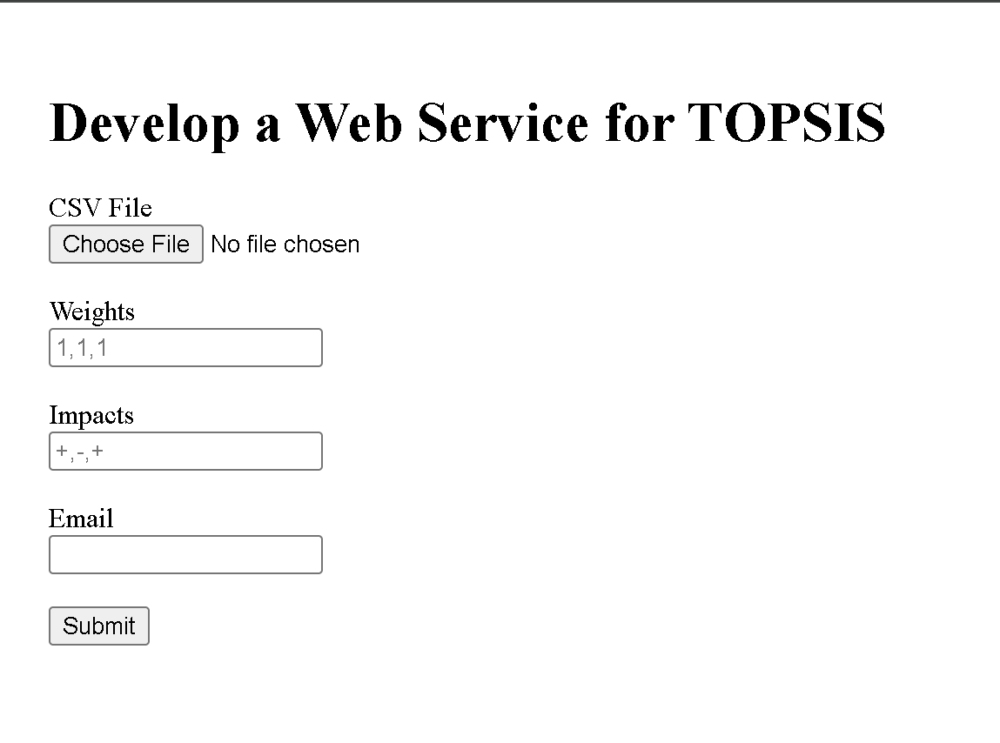

# A1-Topsis
**Name:** HArnoor Singh Khalsa
**Roll No:** 102303260
**Course:** Predictive Analytics UCS654 
---
## What is TOPSIS?

**TOPSIS** (Technique for Order Preference by Similarity to Ideal Solution) is a Multi-Criteria Decision Making (MCDM) method that helps in ranking alternatives based on their similarity to the ideal best solution and distance from the ideal worst solution.

### Key Concept:
- The best alternative should have the **shortest distance** from the ideal best solution
- The best alternative should have the **farthest distance** from the ideal worst solution

---
# TOPSIS Implementation

## Program 1: Command Line Implementation
Command to run:
```bash
python <RollNumber>.py <InputDataFile> <Weights> <Impacts> <ResultFileName>
```

### Input Requirements
- Input CSV file must have 3+ columns
- First column: Object names (M1, M2, etc.)
- 2nd column onwards: Numeric values only
- Weights: Comma-separated (e.g., "0.2,0.2,0.2,0.2,0.2")
- Impacts: Comma-separated +/- (e.g., "+,+,+,+,+")

### Error Handling
- Checks for correct parameter count
- File existence verification
- Numeric values validation
- Weights and impacts count validation
- Impact symbols must be + or -

## Program 2: PyPI Package
https://pypi.org/project/topsis-harnoor-102303260

## Program 3: Web Service For Topsis
[Live Demo](https://topsis-website-6wr5.vercel.app/)


## Installation
You can install this package via `pip`:
```bash
pip install topsis-harnoor-102303260
```

### Usage
The package can be used through the command line. It requires an input CSV or Excel file containing your data, a string of weights, a string of impacts, and the name of the output file.

### Command Syntax
```bash
topsis <InputDataFile> <Weights> <Impacts> <ResultFileName>
```
### Arguments

1. **InputDataFile**: Path to the `.csv` or `.xlsx` file.
   - The file must contain **3 or more columns**.
   - **First column**: Object/Model Name (e.g., M1, M2, M3). This column is not used in calculations but is preserved in the output.
   - **Remaining columns**: Numeric values representing the criteria for each object.

2. **Weights**: Comma-separated numbers indicating the importance of each criterion (e.g., `"1,1,1,1"`).
3. **Impacts**: Comma-separated signs (`+` or `-`) indicating the desired direction of the criterion.
   - `+`: Higher value is better (Profit).
   - `-`: Lower value is better (Cost).

4. **ResultFileName**: Name of the output CSV file where results will be saved.

## Example

Let's assume we want to rank 5 different mobile phone models based on 4 criteria: **Price**, **Storage**, **Camera**, and **Looks**.

### 1. Input Data (`data.csv`)

| Model | Price | Storage | Camera | Looks |
| ----- | ----- | ------- | ------ | ----- |
| M1    | 250   | 16      | 12     | 5     |
| M2    | 200   | 16      | 8      | 3     |
| M3    | 300   | 32      | 16     | 4     |
| M4    | 275   | 32      | 8      | 4     |
| M5    | 225   | 16      | 16     | 2     |

- **Criteria Analysis**:
- **Price**: Lower is better (`-` impact).
- **Storage**: Higher is better (`+` impact).
- **Camera**: Higher is better (`+` impact).
- **Looks**: Higher is better (`+` impact).

### 2. Execution

Run the following command in your terminal:

```bash
topsis data.csv "1,1,1,1" "-,+,+,+" result.csv

```

- **Weights**: `1,1,1,1` (All criteria are equally important).
- **Impacts**: `-,+,+,+` (Price is negative impact, others are positive).

### 3. Output Data (`result.csv`)

The tool generates a new file `result.csv` containing the original data with two additional columns: **Topsis Score** and **Rank**.

| Model | Price | Storage | Camera | Looks | Topsis Score | Rank |
| ----- | ----- | ------- | ------ | ----- | ------------ | ---- |
| M1    | 250   | 16      | 12     | 5     | 0.534277     | 3    |
| M2    | 200   | 16      | 8      | 3     | 0.308368     | 5    |
| M3    | 300   | 32      | 16     | 4     | 0.691632     | 1    |
| M4    | 275   | 32      | 8      | 4     | 0.534737     | 2    |
| M5    | 225   | 16      | 16     | 2     | 0.492650     | 4    |


## Author
Name: Harnoor Singh Khalsa

Roll Number: 102303260
